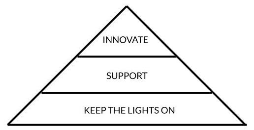

# How we invest our time

In the Technology organization, we spend the vast majority of our budget on salaries. _Time_ is our currency. Bench is investing heavily in our time so that we can figure out how to have impact at scale using technology. We honour this investment by being intentional with and open about how we invest our time. This page provides a framework for how we differentiate between different types of investment, and how we ensure that we're providing the best return.

## Bench Technology Hierarchy of Needs

 Our time investment can be broken into three parts: keeping the lights on, supporting our stakeholders, and innovating our technology. These three categories can be visualized as a hierarchy of needs. The following sections describe how we define and invest in each part.

## Keep the Lights On (KTLO)

Things break. People drop laptops. Libraries are compromised or deprecated. Limits are exceeded. Coders make mistakes. Wifi has limitations. Partners have service interruptions. Cyberattacks happen. Controls need evidence. Etc, etc.

Reacting to the things listed above is the single most important thing we do as the owners of Bench’s technology. The time we spend keeping the lights on is a non-optional investment—if the lights go off, there is no Bench. 

### Investing in KTLO 

KTLO is utterly critical, and utterly low return. If we are successful in keeping the lights on, the net result is that _nothing changes_. Because of this, we work to minimize the amount of time we spend keeping the lights on.

## Support

Our technology was built to support other people. Our infrastructure supports our Product Engineers. Our data pipelines support our analysts. Benchmates rely on the physical hardware that we purchase and configure. Our Operations teams use our tools 40 hours per week. Our clients rely on our app to understand their financials.

These folks make requests of us on a daily basis: Engineers need changes to infrastructure. Analysts need new views and data sources. Benchmates need access to new software. Operations needs to change permissions for users. AAs need tweaks in their workflow. Messages need to be deleted from the message feed. Clients want us to delete their data. Etc, etc.

While not as critical as KTLO, supporting the people who use our technology is hugely important to the success of our company. If we don’t do this, people will get blocked, or choose non-secure workarounds, or work inefficiently, or quit, or churn. 

### Investing in Support 

Some support work is has a low return on investment, like deleting a message from the message feed. Some has a much better return, like creating a view that analysts use for months. If we're lazy, and say yes to every single request we get, the return on our support investment is exactly proportional to the quality of the requests that we get.

Unlike KTLO, it is possible for us to say "no" (or more commonly, "not right now") to support work. This is a very important concept. In order to maximize the return we get on our support investment, we need to ask our stakeholders to communicate the priority of their requests. This will only happen if we give ourselves the power to say "no" to at least some of them. 

Saying "no" also gives us additional time to implement innovative ways of reducing the number of support requests that we get and also the manual KTLO work we're required to do.

## Innovate

> innovate (v.) - "bring in new things, alter established practices", from Latin _innovatus_ "to renew, restore;" also "to change," from _in_- "into" + _novus_ "new".

Default open: it's cliché to use a dictionary definition in a handbook...99.9% of the time. I argue that this one is actually helpful as it illustrates the two possible interpretations of _innovation_: the creation of new things, and the change, renewal, or restoration of existing things.

Our Product Engineering group is concerned primarily with the former interpretation. We invest very heavily in creating new technology that we believe can alter the trajectory of our business. We have become the most efficient full-service bookkeeping company in the world because of years of innovation, and our efforts in the banking space will further impact our ability to impact people at scale.

Our Business Technology group is primarily concerned with the latter interpretation of innovation. The group spends the majority of its time on KTLO and Support, so it's natural that many of the innovations they come up are designed to improve their efficiency in keeping the lights on and supporting other teams. For example, they can reduce the KTLO burden with things like automated code scanning and monitors, and they can reduce the support burden by empowering stakeholders to support themselves (think Retool and Contentful).

### Investing in Innovation

Investment in Innovation is high risk, and high reward—we can't know the impact of a new thing until people are using it. It is also entirely discretionary; indeed Bench could choose to not invest in technological innovation at all. We won't, however, because doing so would be accepting the technological status quo, and we're not even close to where we want to be yet.

The Product Engineering group invests very heavily in innovation—everything other than the Flex Track and Cooldown is 100% innovation. The amount we invest is directly related to our overall strategy, and is therefore decided by Senior Leadership (and subject to board approval). In contrast, the Business Technology group invests a much smaller proportional amount in innovation. The BizTech teams all scale based on the complexity of our business. This auto-scaling is designed to ensure that the teams always have enough bandwidth to innovate.

As mentioned in _Investing in Support_ above, investing in innovation also forces us limit the time we have for Support requests, which forces us to figure out how to prioritize them, which maximizes the return on our Support investment.
