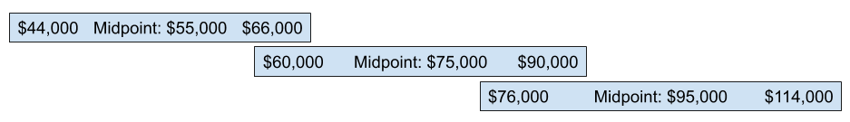

# How we set salaries

Salaries are an integral part of the Employee Value Proposition. The ultimate goal in setting a salary is to seek alignment between employer and employee such that we don't need to have conversations about salary. If an employee feels underpaid, that's a problem. If they feel overpaid, that's also a problem. Efficient salary programs are fair and transparent. This is what we aspire to at Bench.

[Read the blog post about how and why we created this system back in 2020](https://medium.com/lifeatbench/we-built-a-tool-to-help-us-foster-growth-in-our-engineers-45879e4a9892)

## Market Value and Competency

At Bench, there are two key components of salary: market value and competency. **Market value** is driven by the demand that exists for the skills that you have. **Competency** is the level of skill you have within to the role that you've been hired to fill.

### How we determine market value

The first step in determining market value is clearly defining the roles within your organization and the competencies for each role. Our Technology department uses numbered levels to separate roles on our teams. As an example, we go from Engineer 1 to Engineer 6 and each comes with its own clear competencies. 

Once the competencies were clearly defined, we compared them to the two salary databases that we purchase annually: Radford and HR Tech. Salary databases like these collect data from thousands of companies each year. For each job title, they provide the median and mean salaries at the 50th, 75th, and 90th percentile. The basic idea is that you find matches in their database for the roles in your organization, and then use their data to set a competitive salary midpoint—in our case, at the 75th percentile for the North American market.

Salary databases are useful tools for creating a competitive salary program, but they need to be taken with a grain of salt. Job titles are non-standard, and often company-size-dependent. For example, a CTO at a 5-person startup is a very different job from a CTO with a 1,000-person technology team. We've learned that it's rare to find a perfect match to a job title in the database, so the trick is to find those that are closest, and then use a combination of other sources–like job postings and exit interviews–to set the salary midpoint.

Once we've chosen the salary midpoint for a role, creating salary bands is straightforward. At Bench, a salary band is from 0.8 to 1.2 of the salary midpoint. For example, if a midpoint is $100,000, the band is $80,000 - $120,000.

### How we determine competency

Salary bands set the market context for a role, and competency determines an employee's location within the band. We use the competencies that we defined for each role to determine an employee's competency on an annual basis. Here's how it works: 

- The Benchmate does a self-evaluation, marking each skill as either “Yes, I have this skill”, “Not yet”, “Set as objective”–indicating a desire to be doing this within 6 months–or “Not sure”–indicating a desire to have a conversation about it.  
- The manager reviews the Benchmate’s self-evaluation. 
 - When Benchmates work closely with a technical mentor, that mentor will also review the Benchmate’s self-evaluation and provide feedback for the Benchmate and the manager.
 - The Benchmate and manager meet to talk about each skill; celebrating growth, discussing areas where more information is needed or the two are misaligned, and setting new objectives for the months ahead. The output of this conversation is a map of the skills a Benchmates has and skills they need to develop to achieve success in their role. If a Benchmates has all the skills they need for their current role, they are eligible for a promotion to the next level.
 - We use the ratio of skills they have to the total skills required for their role to calculate their position in the band (0.8-1.2) using a default open formula. We call this number the compa-ratio.
 - We then multiply the salary midpoint by their compa-ratio to determine salary

This bullet list looks quite simple, but in reality these sessions are full of deeply honest conversations about growth. They help us set growth objectives, they specify areas of focus, and they ensure that every salary decision that we make is backed by a transparent, documented, and repeatable process.

### How do we handle changes in market value?

If the market changes and salary midpoints are higher, we can simply multiply these midpoints by the compa-ratio to determine updated salaries. This is significantly more efficient than re-reviewing every person every time the market changes. It's also worth noting that we never decrease salaries when the market goes down.

We review market data and updating salary bands at least once per year.

## Promotions

Salary bands can be large, and this is on purpose. They are designed to overlap each other. Here’s a visualization with dummy data:

This is useful for a number of reasons:

- It gives us flexibility to promote early to encourage growth
- In situations where positions are potentially limited, like Managers, it allows us to continue to give salary increases while we seek out a promotion opportunity.
- The overlapping bands mean that promotions don’t come with massive salary increases. This is actually an upside, because it allows us to steadily hand more and more responsibility to a team member as they approach the promotion threshold, such that when we do finally make the leap, the transition is much smoother for all parties.
- There isn’t a hard compa-ratio cutoff for promotion. Each case will be evaluated individually based on the current available positions, the needs of the team, and the interest of the individual. 
