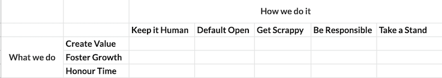

# How we use our principles

Before reading this guide, please read the detailed description of the [Bench Principles](https://bench.co/go/culture/) and the [Technology Principles](technology-principles.md).

## Why principles?

When companies are small, culture is relatively easy to keep an eye on. There are a small number of people working on a small number of things, so everyone more or less talks about everything. As companies grow, this level of cohesion becomes first difficult and eventually impossible. How then can we maintain a consistent culture across a large company? By defining principles.

The Bench and Technology principles read like instructions: _Keep it Human_, _Create Value_, _Be Responsible_, etc. This is by design. In any situation you encounter at work, you can consult the principles and use them to guide the decisions you make. They are also designed to be in tension with each other. _Get Scrappy_ and _Be Responsible_ are a great example of this—we need to be creative and move fast, but not to the detriment of our longterm success.

For example, when Bench _Took a Stand_ on being an anti-racist and anti-discriminatory company, there was a temptation to immediately hire trainers and consultants to level up our education. However, this would have been very expensive, and we were in the middle of a COVID-driven slowdown. It would also have been a "corporate" way to solve a problem, not a creative (and more typically Bench) way of solving a problem. Looking at this situation through our principles, it becomes clear that we needed to balance _Take a Stand_ with _Be Responsible_ and _Get Scrappy_. The decision we made was successful in this balance: we focused first on training our own leaders and then hiring a full time leader to work across Bench to bring about more grassroots change. This included working with consultants, but this was an augmentation of the program rather than the core of it.

A useful analogy is to think of these balanced principles as bumpers on bowling lanes. They help nudge us in the right direction, and when we go too far, the other side nudges us back.

Principles also give us the ability to start categorizing situations. They help us start seeing things as _just another one of those_. The situation described above, for example, is _just another one of those times that we need to be financially responsible while taking a stand_. The ability to categorize situations and apply our principles consistently is key to our ability to maintain our culture as we grow. It also takes a lot of practice, so don't be surprised if the categories aren't obvious right away.

## The Two Levels of Technology Principles

Each of the high-level Technology Principles has a set of supporting principles. Where the high-level principles are instructions, the supporting principles are assertions. Each of them answers the question: why is this high-level principle important? The also serve to guide our implementation of the instruction. Similar to how the high-level principles balance the other high-level principles, the supporting principles balance each other.

For example, the _Honour Time_ principle has several assertions that balance each other. We need to hit most of our timelines while pushing ourselves and not working overtime. We also need to fail sometimes to ensure we aren't sandbagging our time commitments but not too often otherwise we will lose the trust of our customers. All of these things need to be true for us live the _Honour Time_ principle. This, of course, is hard! We don't expect to always be successful with every supporting principle, but we can use them to nudge us back to the culture we've committed to creating together. 

## Using the Technology Supporting Principles

The supporting principles act as a test suite for our culture. Every conversation we have, whether async or realtime, in a PR or in a Google Doc, can be run through the test suite to determine whether it is consistent with the culture we're creating.

Consider the following conversation: 

> We’ve set deadlines that don’t give me enough time to learn. 

If we run this through the test suite, it flags three supporting principles:

**Create Value**
- `The more we learn, the greater our capacity for creating value.`

**Honour Time**
- `By intentionally limiting the amount of time we spend on our problems, we are adding a constraint that asks us to be continuously creative while solving them.`
- `Learning and doing are not separate endeavors. Within the time we allocate to a problem, we must account for both the need to deliver a solution and the need to properly learn how to deliver it.`

This tells us that this conversation is not consistent with our culture, and it also gives us a starting place for how to change the situation that caused the conversation. In this case, we needed to emphasize that engineers advocate for the time it takes to learn something new, and factor that into the commitments they make.

In the event that a conversation doesn't flag any supporting principles and _still_ feels inconsistent with our culture, we're probably just missing a supporting principle. Our request is that if this happens, you describe the conversation to your manager so we can undertake the effort of either adding or adapting a supporting principle to catch this conversation in the future.

## Using the Bench and Technology principles together

When using the Bench and Technology principles together, it's helpful to think of them as a matrix rather than as a concatenated list. The Technology Principles are **what we do**, and the Bench principles are **how we do it**.

Each of the supporting Technology Principles can be understood using this matrix. For example, `We are most likely to do high-value work when we see it as necessary to advance a cause that we believe in` is _Create Value_ and _Take a Stand_, and `Successes and failures are important because of what we learn from them. By sharing these learnings, we rapidly increase the entire team's knowledge` is _Foster Growth_ and _Default Open_.
