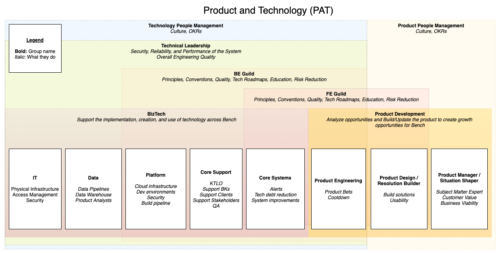

# How we're organized

Creating great technology is a Bench-wide effort. In our day-to-day work, we mostly interface with [8 teams](#groups-and-teams) who report into three departments: `Technology`, `Product`, and `Operations`. The teams are organized into two working groups: `Business Technology (BizTech)` and `Product Development`.

To prevent siloing, we have a **Technical Leadership** group who ensure that the efforts of our teams are complementary, and that our systems are in good health. They work closely with the **Backend Guild** and **Frontend Guild** to create alignment around how we build our technology.

Finally, we have **management groups** who oversee the entire organization. They are charged with building and maintaining our culture, and delivering on the promises we make to our clients and the rest of Bench.

This document focuses on what each group does. To understand how we think about investment across all teams, see [How we invest our time](how-we-invest-our-time.md).

## Groups and Teams
- [BizTech](#biztech)
  - [Core](#core)
    - [Core Support](#core-support)
    - [Core Systems](#core-systems)
  - [IT](#it)
  - [Data](#data)
  - [Platform](#platform)
- [Product Development](#product-development)
  - [Product Engineering](#product-engineering)
  - [Design](#design)
  - [Product](#product)

## BizTech

The Business Technology group exists to support the implementation, creation, and use of technology across Bench. The group's primary function is KTLO and Support; indeed many of the BizTech teams use JIRA support desk to manage the support requests that they receive. It is made up of the **Platform**, **Core**, **Data**, **IT**, and **Bench App Support** teams.

### Platform

The Platform team owns our cloud infrastructure, our build pipeline, and our development environment. They play a big role in enabling Product Engineering, IT, and Data with infrastructural support and guidance. 

#### Core

The Core group maintains and improves our in-house software and its infrastructure. They are organized in two teams: Core Support and Core Systems.

##### Core Support

The Core Support team's primary concern is Keeping the Lights On (KTLO) at the application level, their secondary concern is supporting stakeholder requests that are "too small for a pitch", and their tertiary concern is innovating to make both KTLO and supporting stakeholders more efficient. Core Support works closely the rest of BizTech to handle the issues, outages, and stakeholder requests that arise during our build cycles. In effect, the Core Support team makes the Product Engineering cycles _possible_ by absorbing the myriad distractions that would otherwise derail their focus. The number of engineers on the Core Support team scales based on total number of clients, a proxy for business complexity.

##### Core Systems

The Core System team is focused on improving our technology and processes to enhance the speed and quality of our engineering, with a strong focus on the reduction of technical debt. Unlike Core Support, they work with few distractions in order to increase the speed with which they can make improvements.

### Data

The Data team owns our data pipelines and warehouse. They create the data infrastructure required for us to make business decisions with ever-increasing speed and accuracy, and lead data analysts across Bench in adopting better technology and practices to accomplish this. They test their data infrastructure and processes by serving the Product team directly as analysts, and by filling any gaps in reporting and analysis that emerge from requests of analysts outside the Data team.

### IT

The IT team owns our physical infrastructure (wifi, on-prem VPN, laptops, etc) as well as the access to our software (think Okta, Salesforce, etc). They are responsible for onboarding, offboarding, and a significant amount of our security controls.

_NOTE: BAS actually reports into Operations, but they're a key contributor to BizTech's success_

## Product Development

The Product Development group is charged with building technology that creates growth opportunities for Bench. This can be in the form of new products, like Bench Banking, or in improvements to existing products and workflows. The three teams within the group work very closely together in this work.

### Product Engineering

The Product Engineering group works in build cycles based on the model described in [Shape Up](https://basecamp.com/shapeup/webbook). This system optimizes for two things. First, it ensures that that what we're working on _right now_ aligns with Bench's strategy. Second, it ensures the creation of value on a regular cadence—projects aren't allowed to take longer than the build cycle. How it works:  

Every 8ish weeks the Product team (in collaboration with Engineering and Design) submits pitches for projects for the coming cycle, and senior leaders bet on the ones that they believe will have the biggest impact for our clients. The engineers (in collaboration with Product and Design) then spend 6 focused weeks on the projects that were chosen, and deliver the maximum value that we can within this timeframe. This is followed by 2 weeks of cooldown to handle the various maintenance, refactors, and improvements that have been tabled for the previous six weeks. If a project isn't finished, it can be re-bet upon in the coming cycle.

For a deeper dive on this process, check out [this post on our blog](https://medium.com/lifeatbench/how-we-build-product-at-bench-a095d7f62872).

### Design

The Design team is asked to concretely point toward a future that doesn’t exist yet. They work closely with the Product team to deeply understand problems, and with the Product Engineers to deeply understand potential solutions, and use that understanding to define in real terms how the next thing we build will work and what it will look like. They work directly alongside engineers in the Focus track to bring these solutions into reality.

### Product

The Product team is asked to deeply understand our domain, our clients, and our business strategy. They are experts in distilling the problems our clients face, and for suggesting innovations that solve or reduce these problems. They work closely with Design and the Product Engineers.