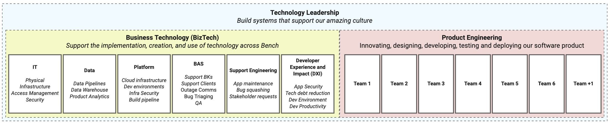

# How we're organized

The Technology Organization is made up of two departments: Business Technology (BizTech) and Product Engineering (Prod Eng). Each department is made up of multiple teams, and each team has a specific mandate. We also work very closely with Product and Design—you'll often hear us using the acronym TPD to describe our working group, which stands for Technology, Product, and Design.

This document is written to help you understand what each of these teams does. For a deep dive on how we think about investment across all teams, see [How we invest our time](how-we-invest-our-time.md).

## Departments and Teams
- [Technology Leadership](#technology-leadership)
- [BizTech](#biztech)
  - [IT](#it)
  - [Data](#data)
  - [Platform](#platform)
  - [Bench Application Support (BAS)](#bench-application-support-bas)
  - [Support Engineering](#support-engineering)
  - [Developer Experience and Impact (DXI)](#developer-experience-and-impact-dxi)
- [Product Engineering](#product-engineering)
  - [Teams & Work Streams](#teams--work-streams)
- [Design](#design)
- [Product](#product)

## Technology Leadership

The Technology Leadership group is made up of our VP, our Directors, our Principal Engineer, and our Manager of Technology Culture Systems. The members of this team are the stewards of our Technology Culture, and work together to build systems that enshrine our principles.

## BizTech

The Business Technology group exists to support the implementation, creation, and use of technology across Bench. The group's primary function is KTLO (Keeping The Lights On) and Support; indeed many of the BizTech teams use JIRA support desk to manage the support requests that they receive. It is made up of the **IT**, **Data**, **Platform**, **Bench Application Support (BAS)**, **Support Engineering**, and **Developer Experience and Impact (DXI)** teams.

### IT

The IT team owns our physical infrastructure (wifi, on-prem VPN, laptops, etc) as well as the access to our software (think Okta, Salesforce, etc). They are also responsible for onboarding, offboarding, and a significant amount of our security controls.

### Data

The Data team owns our data pipelines and warehouse. They create the data infrastructure required for us to make business decisions with ever-increasing speed and accuracy, and lead data analysts across Bench in adopting better technology and practices to accomplish this. They test their data infrastructure and processes by serving the Product team directly as analysts, and by filling any gaps in reporting and analysis that emerge from requests of analysts outside the Data team.

### Platform

The Platform team owns our cloud infrastructure, our build pipeline, and our development environment. They play a big role in enabling Product Engineering, IT, and Data with infrastructural support and guidance. 

### Bench Application Support (BAS)

BAS handles all internal and external bug reports, questions, and stakeholder requests. They're also experts in our applications, and regularly provide help and training to unblock other Benchmates. Increasingly they're taking on other functions, like QA and security compliance.

### Support Engineering

The Support Engineering team's primary concern is KTLO in our application level, their secondary concern is supporting stakeholder requests that are "too small for the roadmap", and their tertiary concern is innovating to make both KTLO and supporting stakeholders more efficient. Support Engineering works closely with the rest of BizTech to handle the issues and outages if/when they arise. In effect, the Support Engineering team allows Product Engineering to execute with increased focus. 

### Developer Experience and Impact (DXI)

The DXI team is focused on tools, frameworks, techniques, practices, and systems that help bring joy to the software development experience and to reduce any negative impacts, friction, and pain that our engineers experiencing while building our software.

## Product Engineering

The Product Engineering team works closely with Product and Design to build technology that creates growth opportunities for Bench. This can be in the form of new products, or in improvements to existing products and workflows. They are key players in executing both our Technical and Product Roadmaps.

### Teams & Work Streams

_Work Stream: A time-bound area of investment. ie. Bookkeeper Efficiency, Self-Serve Onboarding_

There are currently 6 teams in Product Engineering. Each of these teams focus on one work stream at a time. Work streams are long-lived, generally 6-18 months. The teams are made up several Product Engineers, a Product Manager, and a Designer.

### Design

The Design team is asked to concretely point toward a future that doesn’t exist yet. They work closely with the Product team to deeply understand problems, and with the Product Engineers to deeply understand potential solutions, and use that understanding to define in real terms how the next thing we build will work and what it will look like. They work directly alongside engineers in the Focus track to bring these solutions into reality.

### Product

The Product team is asked to deeply understand our domain, our clients, and our business strategy. They are experts in distilling the problems our clients face, and for suggesting innovations that solve or reduce these problems. They work closely with Design and the Product Engineers.
