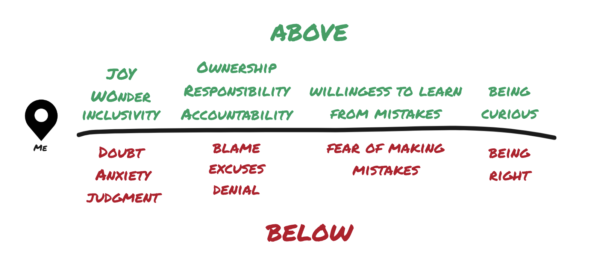

# Inspiring Action

As team members, it is critical that we practice the skill of describing the world around us. We do this to create a shared understanding of _what is happening_ so that we can decide _what to do about it_. Creating shared understanding cannot be done alone; it is a group activity, surfaced through conversation.

In this page, we introduce two concepts. The first, _Assertions & Assessments_, teaches us how to use conversations to prepare our teams for action. The second, _Above/Below the Line_, helps us view (and therefore describe) the world with deep empathy, responsibility, and willingness to grow. When put together, these result in a skill we call _Inspiring Action_.

## Concept #1: Assertions and Assessments

_In this section, we're borrowing heavily from Peter J. Denning's [excellent article](#additional-resources) on the topic._

_Inspiring Action_ has its foundation in two [acts of speech](#additional-resources): **Assertions** and **Assessments**. Both have multiple interpretations depending on how and when they're used. For the purposes of conversations at Bench, we will use Denning's definitions:

> ### Assertions
> Assertions are claims about what is observable in the world. They are capable of being witnessed and the witnesses can classify them as true or false. Logical propositions and statements of fact are common instances. Examples:
> - The cup is on the table.
> - Bob received an award for his work.
> - Alice stood at the doorway.
> 
> These are all assertions because they can be either true or false and they can be witnessed by observers. Note that statements about your internal state, such as:
> - I am happy.
> - I have a stomach ache.
> - She crammed knowledge into her head.
> 
> are not assertions by this definition; while they may be true for the speaker, there is no way another observer can verify them.
> A subtle but important aspect of an assertion is that it is accompanied by a commitment from the speaker to stand behind the truth of the claim and to take the consequences if it is not true. This underlying commitment is why assertions qualify as acts of speech.
> 
> ### Assessments
> Assessment are evaluations, judgments, or opinions about the world. They are claims made by the speaker, but unlike assertions they cannot be verified by witnesses. The second set of three statements listed above qualify as assessments by this definition.
> 
> Many people do not distinguish between assertions and assessments, a confusion that leads to misunderstandings and miscoordinations. You have seen this all too often when someone claims their opinion is a fact; they will often persist with their claim even when you point out that it is only an opinion. A stereotypical example is:
> - “My candidate is the best qualified for president.”
> - “That’s just your opinion.”
> - “No, it’s a fact.”
>
> An example that might occur in a team is
> - “We should do so-and-so.”
> - “Why?”
> - “Because I have more experience than you and I know from my long years of experience that it is so.”
> 
> The speaker acts as if their experience is an observable fact that trumps anything the other person might say.
> 
> Like assertions, assessments are accompanied by commitments from the speaker. This time the commitment is to stand behind the assessment, to take responsibility for it, and to deal with consequences that may follow when people act on the assessment. Assertions seek to establish what is so in the world. Assessments seek to prepare people for action.

### Grounded and Ungrounded Assessments

The vast majority of the time, when describe the world around us, we are making assessments, not assertions. This is entirely natural—we perceive reality via our uniquely configured senses, and understand it relative to our lived experiences. We therefore tend to describe the world as it relates to us, not as a set of statements about things that can be witnessed.

Take a moment to reflect on some of the assessments you've made or heard recently with your teams (if it helps, we can use other descriptors here, like "opinions" and "arguments"). Were some of these assessments strong and inspiring? Were others weak and unconvincing? What is the cause of this difference?

This difference is rooted in the practice of _grounding_ assessments. Again, we'll get Denning's help in defining this:

> A grounded assessment is an assessment accompanied by a list of assertions that support the assessment. The purpose of grounding is to convince someone else to accept the assessment. Accepting the assessment is a prelude for action. One is unlikely to act on an assessment one does not accept.

Taking this back to your reflections above: the assessments that you heard as strong and inspiring were likely grounded sufficiently to prepare you to take action on them. 

_"The purpose of grounding is to convince someone else to accept the assessment"_. It isn't enough to simply provide a list of assertions. These assertions must meet two conditions:

- *Relevancy*: the assertion(s) must be in the same domain as the assessment.
- *Sufficiency*:  the assertion(s) must satisfy criteria of acceptability imposed by the listener.

It's helpful to look at examples. First, let's look at a conversation where assertions are not relevant to the assessment:

- **Person 1**: We're experiencing an outage!
- **Person 2**: Can you tell me more?
- **Person 1**: [Another Person] can't access our software on their laptop.
- **Person 2**: What does their error message say?
- **Person 1**: There's a picture of a dinosaur, and the message says they cannot connect to the internet.
- **Person 2**: Tell them to reboot their router. This is not an outage.

Next, let's look at a conversation where assertions are relevant yet insufficient to satisfy the listener's criteria of acceptability:

- **Person 1**: We're experiencing an outage!
- **Person 2**: Can you tell me more?
- **Person 1**: We're recording elevated 500 errors in [a key system].
- **Person 2**: How do these compare to normal levels?
- **Person 1**: They are slightly higher than normal.
- **Person 2**: How long have we been recording these errors?
- **Person 1**: We went slightly over our threshold 20 minutes ago. Looking more stable now.
- **Person 2**: Let's keep an eye on this for a while before we involve the team.

Now, let's look a conversation where the assessment is grounded in a way that convinces the other speaker to accept it:

- **Person 1**: We're experiencing an outage!
- **Person 2**: Can you tell me more?
- **Person 1**: We're recording elevated 500 errors in [a key system].
- **Person 2**: How do these compare to normal levels?
- **Person 1**: They are significantly higher: there's a big, sudden spike.
- **Person 2**: How long have we been recording these errors?
- **Person 1**: 14 minutes.
- **Person 2**: I agree: we're experiencing an outage. 
_(Action follows)_

Take a moment to observe what happened here. Person 1 made an assessment. It was grounded through conversations with Person 2. Person 2 accepted the assessment. Now, they are prepared to take action.

Note that in the conversations above Person 2 comes across as a leader, and Person 1 doesn't. This is because Person 2 is relentless in gathering assertions before accepting Person 1's assessment. Person 1 would show up very differently if they had grounded their initial assessment:

- **Person 1**: We're recording a sudden, big spike in errors in [a key system]. This spike has been sustained for 14 minutes. We're experiencing an outage.
- **Person 2**: Agreed.
_(Action follows)_

This is a significantly more effective conversation. Person 1 provided their assertions before making the assessment. These assertions were relevant to the assessment, and met Person 2's criteria of acceptability. In this short exchange, Person 1 prepared their team for action. This is how strong leaders communicate.

Keep in mind that grounding an assessment doesn't make it true. While it is derived from measurable facts, a grounded assessment is still one's interpretation of a situation, nothing more. For example, in the example above, the 500 errors could have been the result of a scheduled migration that neither person knew about. We must always remain open to more assertions, _especially_ if they disqualify our current assessments.

### Summary: Assertions and Assessments

Assertions seek to describe the world objectively. Assessments seek to describe the world in a way that prepares others for action. People must accept an assessment before they're willing to take action. For an assessment to be accepted, it must be grounded by relevant assertions that are sufficient to satisfy whatever criteria the listeners have. Therefore, when grounding assessments, we must both pro-actively provide our assertions and listen for any remaining unsatisfied criteria. This takes work, and it's worth it.

## Concept #2: Above/Below the Line

The above image shows a very popular coaching tool: the idea of your internal "location" relative to a simple black line. There are two places you can be: above the line, or below the line. If you are above the line, you are experiencing the world with wonder, joy, inclusivity, a willingness to learn from mistakes, and a deep sense of ownership and responsibility. If you are below the line, you are experiencing the world with doubt, anxiety,  fear of making mistakes, and a tendency to blame others or make excuses for how things are. When you're above the line, you're focused on being curious. When you're below the line, you're focused on being right.

We all live on both sides of the line. That's what it is to be human. Indeed the oldest parts of our brain are _hardwired_ to place us below the line to ensure our survival in the event of a threat. The problem is that they can't differentiate  a threat to our person from a threat to our ego.

We must therefore engage in the practice of asking ourselves whether we are above the line or below the line in any situation. Being below the line isn't a bad thing, but it is  important to recognize—when you're below the line, you're not in a place where you can be a great teammate or leader. Your location relative to the line will show up in your mood, your physicality, and your conversations—particularly in the assessments that you make.

If you find yourself describing the world from below the line, it's a perfect time to take a breath, and either "relocate"  your inner self or remove yourself from the conversation until you can.

## Inspiring Action

We now understand assessments and "the line". When we combine these two concepts, we create conversations that are more likely to **inspire action** from others.

Let's take a moment to review an important part of Denning's definition of Assessments:

> Like assertions, assessments are accompanied by commitments from the speaker. This time the commitment is to stand behind the assessment, to take responsibility for it, and to deal with consequences that may follow when people act on the assessment.

This definition is steeped in ownership, responsibility, and accountability. These are "above the line" qualities. To illustrate how important this is, let's look at assessments made from below and above the line:

- **Person 1**: I'm horribly unproductive at work.
- **Person 2**: Yeah?
- **Person 1**: I spend an average of 6 hours a day in meetings. Of these meetings, only 1 in 4 are scheduled by me.
- **Person 2**: Yikes.
- **Person 1**: I speak only occasionally in these meetings; mostly I just sit and listen. I'm _horribly_ unproductive at work.
- **Person 2**: Yeah, that sounds awful.

Person 1 makes the assessment that they're horribly unproductive at work. This is an assessment made from below the line: full of self-doubt, anxiety, and perhaps fear of the consequences. Person 2 commiserates, and ultimately accepts Person 1's assessment. Has this conversations inspired anyone to take action?

So what if this assessment were made from above the line?

- **Person 1**: I need to level up my participation in meetings and take control of my calendar.
- **Person 2**: Yeah?
- **Person 1**: I spend an average of 6 hours a day in meetings. Of these meetings, only 1 in 4 are scheduled by me.
- **Person 2**: Yikes.
- **Person 1**: I speak only occasionally in these meetings; mostly I just sit and listen. I _need_ to level up my participation in meetings and take control of my calendar.
- **Person 2**: How can I help?

This conversation has the same assertions as the conversation above it. The difference is that this assessment is made from above the line: full of ownership, responsibility, and accountability. Person 2 accepts the assessment, and is even inspired to offer their help. Action is imminent.

The line acts as an acid test for the effectiveness of an assessment. If an assessment is made from below the line, it presents a limited view of how things might get better. Therefore, it is unlikely to inspire action from others. If an assessment is made from above the line, it presents an expansive and inclusive view of how things might get better. Therefore, it is more likely to inspire action from others.

## Practicing this Skill

There are many components to this skill:
1. Identifying if a statement is an assertion or an assessment
2. Identifying if an assessment is grounded
3. Grounding assessments in conversation
4. Pro-actively grounding assessments
5. Locating yourself above or below the line
6. Testing whether a grounded assessment is above or below the line
7. Making grounded assessments that are above the line—AKA Inspiring Action

We recommend that each be practiced first in isolation, and then together. 
- 1 and 2 can be practiced when listening to any conversation. 
- 3 and 4 are best practiced in groups—this is a great as a team building exercise. 
- 5 is an introspective practice that often requires input from a coach: 1:1s are a great venue for this. 
- 6 requires competence in the first 5 skills, and is best done in groups (to help ground these assessments about assessments!)
- 7 is best practiced when _you_ want to see something change. The best way to learn is to try to inspire others to take action!

## Additional Resources

- [Assertions and Assessments](https://denninginstitute.com/pjd/TT/AssertAssess.pdf), Peter J. Denning
- [Speech Acts](https://s3.amazonaws.com/cgdoc/speech_acts.pdf), Ed Stroupe
- [Locating Yourself - A Key to Conscious Leadership](https://www.youtube.com/watch?v=fLqzYDZAqCI), The Conscious Leadership Group
- [Above The Line – Are You Worth Following?](https://www.youtube.com/watch?v=4uv_g1hQtKE), DeviateLLC
