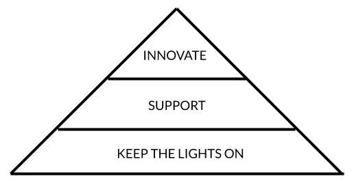

# On Technology Investment

In the Technology organization, we spend the vast majority of our budget on salaries. Put simply, Bench is investing heavily in our time so that we can figure out how to have impact at scale using technology. We honour this investment by being intentional with and open about how we spend our time. This page provides a framework for how we differentiate between different types of investment, and how ensure that we're providing the best return.

## Bench Technology Hierarchy of Needs

 The time we spend creating technology can be broken into three parts: keeping the lights on, supporting our stakeholders, and innovating our technology. These three categories can be visualized as a hierarchy of needs. In the following sections, we'll describe how we define and invest in each part.

## Keep the Lights On (KTLO)

Things break. People drop laptops. Libraries are compromised or deprecated. Limits are exceeded. Coders make mistakes. Wifi has limitations. Partners have service interruptions. Cyberattacks happen. Controls need evidence. Etc, etc.

Reacting to the things listed above is the single most important thing we do as the owners of Bench’s technology. The time we spend keeping the lights on is a non-optional investment—if the lights go off, there is no Bench. 

### Investing in KTLO 

KTLO is very important, and utterly low return. If we are successful in keeping the lights on, the net result is that _nothing changes_. Because of this, we minimize the amount of time we spend keeping the lights on.

## Support

Our technology was built to support other people: Our infrastructure supports our Product Engineers. Our data pipelines support our analysts. Benchmates rely on the physical hardware that we purchase and configure. Our Operations teams use our tools 40 hours per week. Our clients rely on our app to understand their financials.

These folks make requests of us on a daily basis: Engineers need changes to infrastructure. Analysts need new views and data sources. Benchmates need access to new software. Operations needs to change permissions for users. AAs need tweaks in their workflow. Messages need to be deleted from the message feed. Clients want us to delete their data. Etc, etc.

While not as critical as KTLO, supporting the people who use our technology is hugely important to the success of our company. If we don’t do this, people will get blocked, or choose non-secure workarounds, or work inefficiently, or quit, or churn. 

### Investing in Support 

Some support work is has a low return on investment, like deleting a message from the message feed. Some has a much better return, like creating a view that analysts use for months. If we're lazy, and say yes to every single request we get, the return on our support investment is exactly proportional to the quality of the requests that we get.

Unlike KTLO, it is possible for us to say "no" (or more commonly, "not right now") to support work. This is a very important concept. In order to maximize the return we get on our support investment, we need to ask our stakeholders to communicate the priority of their requests—this will only happen if we give ourselves the power to say "no" to at least some of their requests.

## Innovate

If all we ever did was KTLO and Support, Bench’s growth would be entirely determined by other business units. An investment in innovation gives us the ability to take a step back from KTLO and Support, look for patterns, and implement innovative technology that empowers our users.

This is a purely discretionary spend. On any team, we could choose to only invest in KTLO and Support, but we should factor in the following:

- Innovation is what has made us the biggest bookkeeping company in North America. If we stop, others will catch up. That’s not how we fulfill our mission.
- If we choose to not invest in innovation, we are accepting the status quo. This means that the teams we support are unlikely to see leaps in efficiency. It also means that our technology teams will scale linearly as Bench grows—they simply won’t have time to make themselves more efficient. 
- Time spent innovating is generally the portion of work most enjoyed by technologists. It is also generally the work that leads to the most significant increase in ability. If we don’t invest in it, we risk attrition and/or mediocrity in our teams.

If ever a team does not have enough time to innovate, they are under-resourced.

## How this looks in real life

Innovation for us usually means that we’re building something new. Once this thing exists, we need to keep its lights on, and support the folks who use it. This means that investment in innovation adds to our maintenance burden over time. We therefore need to forecast an increase of KTLO/Support costs that is proportional to the investment we make in innovation. There’s an exception here: sometimes innovation actually leads to a decrease in KTLO/Support costs. In general: more technology means higher maintenance costs.

In the world of Product Engineering, we invest very heavily in innovation, about 75% of our time is spent on net new. 25% of our time needs to be spent on KTLO/Support. It’s critical that we don’t have a group of people who only do this work. As demonstrated in the case studies below, this creates significant risk of attrition.

In the world of Business Technology (BizTech), our proportional innovation spend is much smaller, and therefore the risk of running out of innovation capacity is greater.. For each team within the group, we need to determine what business factors we can correlate with needing to increase our headcount. For IT, it’s likely Benchmates. For Data, it could be BizOps headcount. For Platform, it could be Product Eng headcount.

The tough nut to crack is the time that Product Engineering spends on KTLO/Support. We’ll need to experiment to figure out what factors best correlate with a need for more headcount here. I’m open to great ideas!
